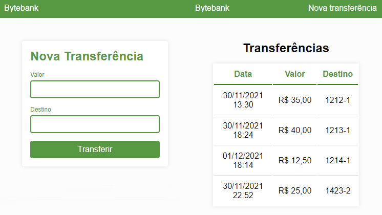

<p align="center"> 💻 Atualizado em 30 de Novembro de 2021 💻</p>

<h1 align="center"> :moneybag: ByteBank :moneybag:</h1>

<p align="center">
  

  

  <a href="https://github.com/gabrielcoelhox/chess-game-java/commits/main">
    
  </a>
</p>

[Projeto](#id1)&nbsp;&nbsp;&nbsp;|&nbsp;&nbsp;&nbsp;
[Como executar o projeto](#id2)&nbsp;&nbsp;&nbsp;|&nbsp;&nbsp;&nbsp; 
[Demonstração](#id3)

## <a id="id1"> 💻 Projeto </a>

Este projeto foi desenvolvido com o intuito de exercitar o conteúdo aprendido no curso de formação em *__[Angular][Angular]__* da Alura. Bytebank é um sistema básico que simula transferências bancárias. É possível realizar transferência e visualizar o extrato.

 

## <a id="id2">:hammer_and_wrench: Como executar o projeto

### Pré-requisitos

Antes de começar, você vai precisar ter instalado em sua máquina as seguintes ferramentas:
- [Git](https://git-scm.com);
- [Node.js][nodejs];
- [VSCode][vscode] (para trabalhar mais facilmente com o código)

<details>
<summary><strong>Rodando a aplicação web (Front End)</strong></summary>

```bash
# Clone este repositório
$ git clone https://github.com/gabrielcoelhox/bytebank.git
# Instale as dependências
$ npm install
# Inicie a aplicação
$ ng s -o
# A aplicação será aberta na porta:3000 - acesse http://localhost:3000
```
</details>

<details>
<summary><strong>Rodando json-server(Front End)</strong></summary>

```bash
$ cd dados
# Instale as dependências
$ json-server --watch db.json
# Inicie a aplicação
$ ng s -o
# A aplicação será aberta na porta:3000 - acesse http://localhost:3000
```
</details>

## <a id="id3"> 🖼️ Demonstração </a>


 
[nodejs]: https://nodejs.org/
[angular]: https://angular.io/
[vscode]: https://code.visualstudio.com/
[vceditconfig]: https://marketplace.visualstudio.com/items?itemName=EditorConfig.EditorConfig
[license]: https://opensource.org/licenses/MIT
[vceslint]: https://marketplace.visualstudio.com/items?itemName=dbaeumer.vscode-eslint
